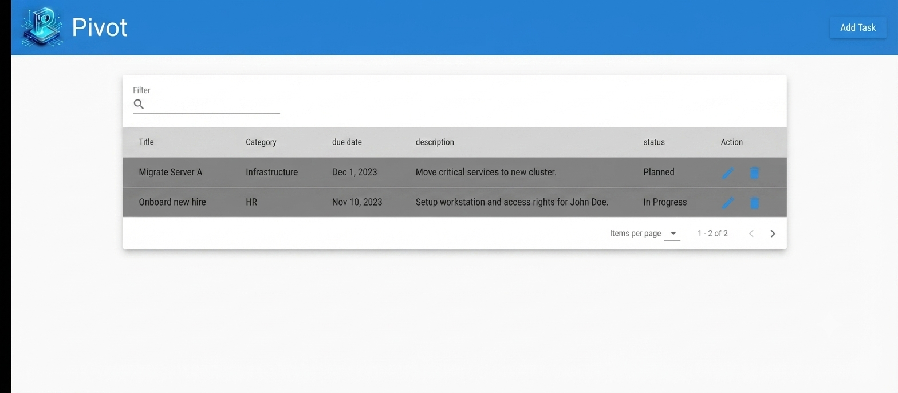
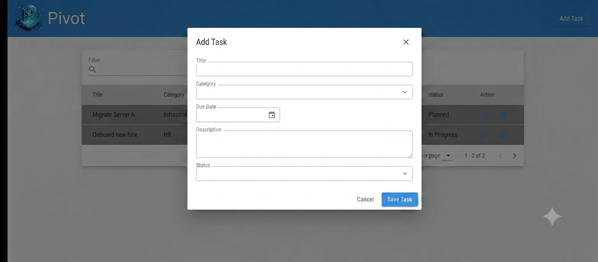
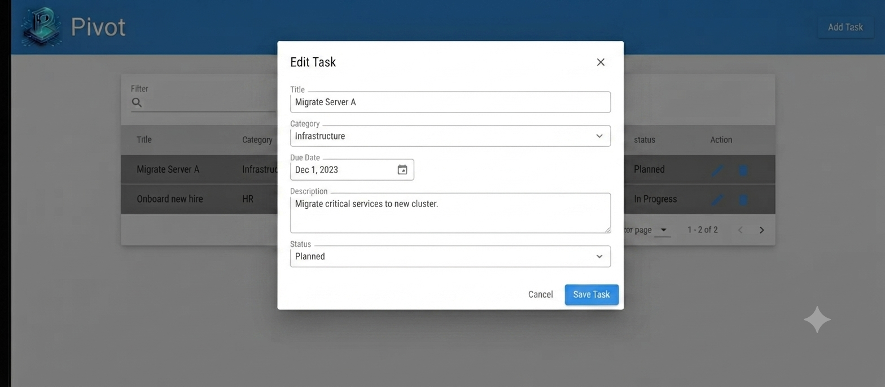

# Implementation Plan: Task Management

**Branch**: `001-task-management` | **Date**: 2026-07-18 | **Spec**: [Link](specs/001-task-management/spec.md)

**Input**: Feature specification from `specs/001-task-management/spec.md`

## Summary

This feature adds task management capabilities to the Pivot application. Users can create, view, sort, filter, paginate, and edit tasks. The technical approach leverages Angular v22+ signals for state management, localStorage for data persistence, and a decoupled service-based architecture.

## Technical Context

**Language/Version**: TypeScript 6.0.2
**Primary Dependencies**: Angular 22, @angular/forms/signals
**Styling**:Tailwindcss 4.3.3
**UI Framework**: Angular Material (Theme Azure Blue), components: verbose datepicker, MatDialog, Tonal buttons, mat-select, MatPaginator, MatSort, MatFormField/MatInput (for search/filtering)
**Storage**: localStorage
**Testing**: Vitest
**Target Platform**: Web (modern browsers)
**Project Type**: Web application
**Performance Goals**: Responsive UI interactions, immediate task updates
**Constraints**: Local data persistence, must pass AXE accessibility checks. Row reordering is disabled. Grid sorting is strictly driven by column headers.
**Scale/Scope**: Small-scale task management application

## UI & Visual Layout

### 1. Task List View (Main Dashboard)
The Task List view MUST serve as the primary entry point when the application loads.

- **Container**: The layout MUST be presented as a centralized, high-contrast data card overlaying a light neutral background using Tailwind CSS.
- **Global Navigation Bar**: 
  - MUST be a full-width persistent banner using the Azure Blue palette.
  - MUST feature the "Pivot" branding on the left.
  - MUST feature a standalone "Add Task" button on the right (triggering the TaskModalComponent).
- **Search & Filtering Layer**:
  - MUST contain a streamlined text input labeled "Filter" with a magnifying glass icon.
  - Logic: This input MUST perform real-time, case-insensitive filtering of the `title` property.
- **Core Task Data Grid**:
  - MUST be a structured tabular grid.
  - Header: Every sortable column header MUST include visual upward and downward arrow icons to indicate available sort states.
  - Columns: MUST include Title, Category, Due Date, Description, Status, and Action.
  - Actions: Action column MUST include inline blue pencil (edit) and trash bin (delete) icons.
  - Styling: Rows MUST employ alternating dark-neutral striping.
  - Architecture: Sorting logic MUST be implemented via custom Angular Signals (`computed()`).
- **Pagination Footer**:
  - MUST be anchored to the bottom right.
  - MUST feature an "Items per page" dropdown.
  - MUST feature a passive item tracker (e.g., "1 - 2 of 2").
  - MUST feature functional forward/backward arrows.


---

### 2 Task Modal (Shared)
Implement a single, reusable `TaskModalComponent` using `MatDialog`. This component MUST serve as the unified entry point for both task creation and task editing.

- **Logic Injection**: The component MUST utilize `MAT_DIALOG_DATA` to determine its operational state. 
  - If `data` is provided, the component SHALL initialize in **Edit Mode** and populate form controls with the passed `Task` object.
  - If `data` is null, the component SHALL initialize in **Add Mode** with empty/default form controls.
- **Form Infrastructure**:
  - The component MUST use Angular Reactive Forms.
  - Form state (Title, Category, Due Date, Description, Status) MUST be bound via Angular Signals.
- **Header Area**:
  - The component MUST dynamically render the title string ("Add Task" or "Edit Task").
  - A right-aligned "X" icon MUST be implemented for modal dismissal.
-- **UI Components**:
  - **Title**: `mat-input` (required).
  - **Category**: `mat-select` (Enum: Personal, Work, Finance, Health).
  - **Due Date**: Verbose Datepicker (calendar icon).
  - **Description**: `textarea` (multi-line).
  - **Status**: `mat-select` (Enum: New, In Progress, Rejected, Verified, Completed).
  - **Validation & Errors**: Mandatory fields MUST display standard Angular Material `<mat-error>` messages in red text immediately beneath the invalid input field when touched or submitted.
- **Footer Action Controls**:
  - MUST render a neutral flat "Cancel" button and a blue tonal "Save Task" button.
  - The "Save Task" button MUST remain disabled until form validation requirements are met.



---


### Constitution Check

*GATE: Must pass before Phase 0 research. Re-check after Phase 1 design.*

- [] Angular Standalone and Signals-First Architecture
- [] Component & Template Discipline
- [] Service and Dependency Injection Standards
- [] Signal & Reactive Forms Discipline
- [] Accessibility (A11y) & Strict TypeScript Quality
- [] Iterative Development Cadence
- []Data Preservation
- []Resilience & Error Handling

### Execution Strategy & Cadence
The agent must follow these strict operational rules:
1. **Atomic Execution**: Break the Implementation Roadmap into atomic, testable tasks.
2. **The Cycle**: 
-Write Test: Create or update the unit test to define the expected behavior.
-Write Implementation: Write the code required to pass the test.
-Execute Unit Test: Run ng test to verify logic.
-Execute Build Check: Run ng build --configuration development to ensure the dependency graph is valid and the application compiles successfully.

3. **Critical Halt**: Only AFTER both ng test (Logic Pass) AND ng build (Integration Pass) succeed, the agent MUST halt execution, display [WAITING FOR MANUAL VERIFICATION], and wait for developer approval before initiating the next task.
4. **Build Failure Policy**:If ng build fails, the task is considered FAILED. The agent MUST resolve build errors before proceeding to the Halt stage.

### Development Standards
* **Resilience**: Every service call and asynchronous operation MUST be wrapped in error handling as per the Constitution (Section VIII). This is a non-negotiable requirement for every implementation step.

## Project Structure

### Documentation (this feature)

```text
specs/001-task-management/
├── plan.md              # This file
├── research.md          
├── data-model.md        
├── quickstart.md        
└── contracts/           
```

### Source Code

```text
src/
└── app/
    ├── app.component.ts          # Root Shell: The main skeleton
    ├── app.component.html        # Root Shell: Holds Nav and <router-outlet>
    ├── app.component.spec.ts     # Root Shell: Tests
    ├── app.config.ts             # Global configuration (providers, etc.)
    ├── components/
    │   ├── task-list/
    │   │   ├── task-list.component.ts
    │   │   ├── task-list.component.html
    │   │   └── task-list.component.spec.ts
    │   └── task-modal/
    │       ├── task-modal.component.ts
    │       ├── task-modal.component.html
    │       └── task-modal.component.spec.ts
    ├── services/
    │   ├── storage.service.ts
    │   ├── task.service.ts
    │   └── error-handling.service.ts  # Required by Constitution Sec VIII
    └── models/
        └── task.model.ts
```

**Structure Decision**: Web application utilizing standalone Angular components with signal-based state management.

**Model**
```typescript
export interface Task {
  id: string;
  title: string;
  category: 'Personal' | 'Work' | 'Finance' | 'Health';
  dueDate: string; // ISO 8601 format, enforced by Verbose Datepicker
  description: string;
  status: 'New' | 'In Progress' | 'Completed' | 'Rejected' | 'Verified';
  isActive: boolean; // Defaults to true on creation, false on deletion. Correctly handles the "Delete is not a delete" requirement.
}
```

**Services**

`ErrorHandlingService`:
- Purpose: Centralized logging and error formatting as required by Constitution Sec VIII.
- Methods:
  - `logError(context: string, error: unknown)`: MUST format errors into a standardized JSON structure before outputting to the console.

`StorageService`:
- Purpose: Manages all data persistence utilizing the browser's `localStorage`.
- Methods:
  - `loadTasks(): Task[]`
  - `saveTasks(tasks: Task[])`
- Dependencies: MUST inject `ErrorHandlingService`. All `localStorage` access attempts MUST be wrapped in error handling to catch quota limits or privacy blocking exceptions.

`TaskService`:
- State: Manages an Angular signal containing the array of `Task` objects.
- Methods:
  - `addTask(task: Task)`
  - `updateTask(task: Task)`
  - `getTasks()`
  - `deleteTask(id: string)`: MUST implement soft delete by setting `isActive = false` instead of removing the object.
- Dependencies: MUST inject `ErrorHandlingService` and `StorageService`. All operations MUST be wrapped in error handling.

## Complexity Tracking

| Violation / Custom Choice | Why Needed | Simpler Alternative Rejected Because |
| :--- | :--- | :--- |
| **Verbose Datepicker** | Ensures explicit date formats are visible and fully readable for strict data entry. | Standard HTML5 date inputs look different across browsers and don't enforce consistent visual constraints. |
| **Custom Signal-Based Sorting** | To sort tasks instantly in memory using modern Angular `computed()` state. | The standard `MatTableDataSource` helper is built for legacy RxJS/component lifecycles and doesn't align with our Signals-First architecture. |

